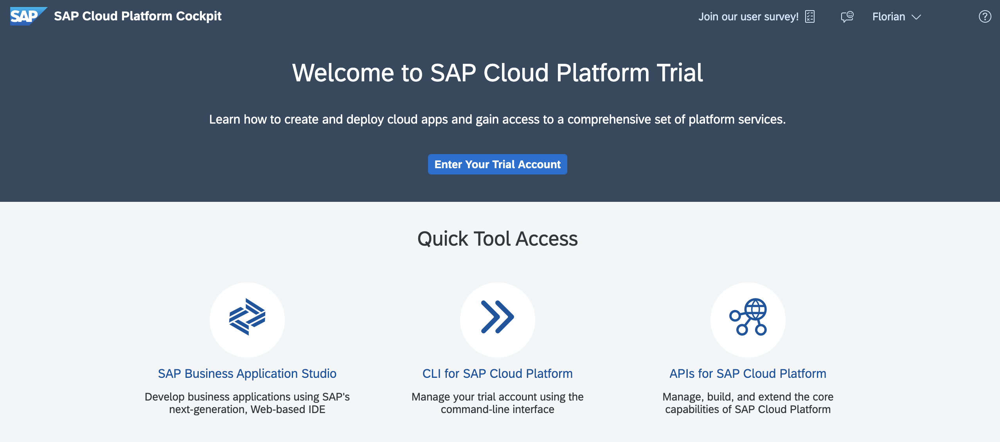
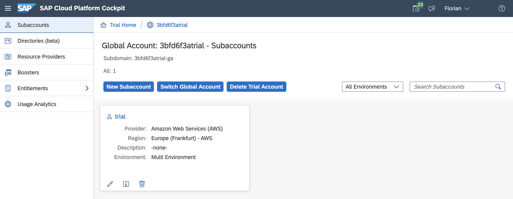
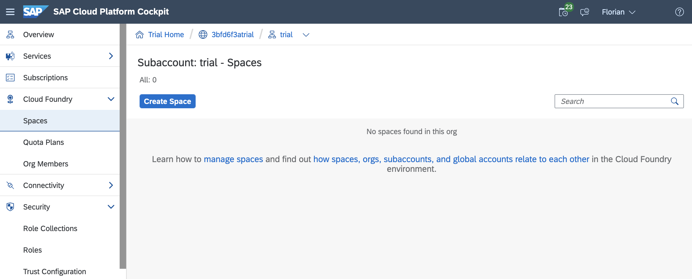
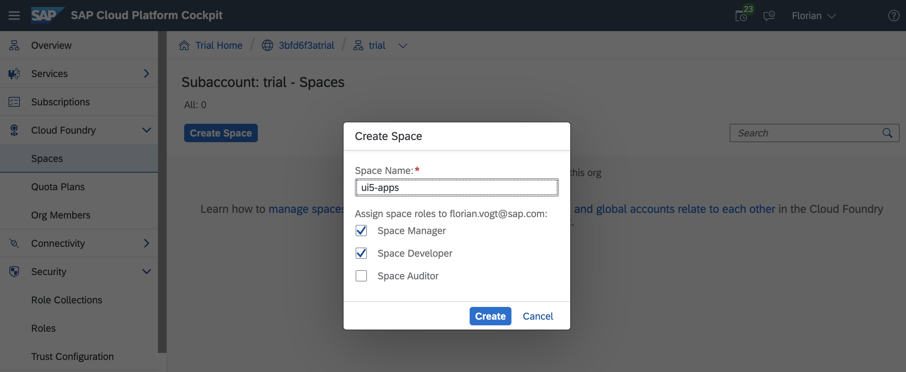
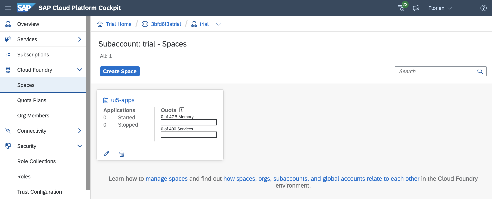
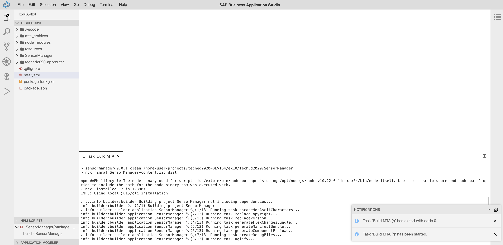
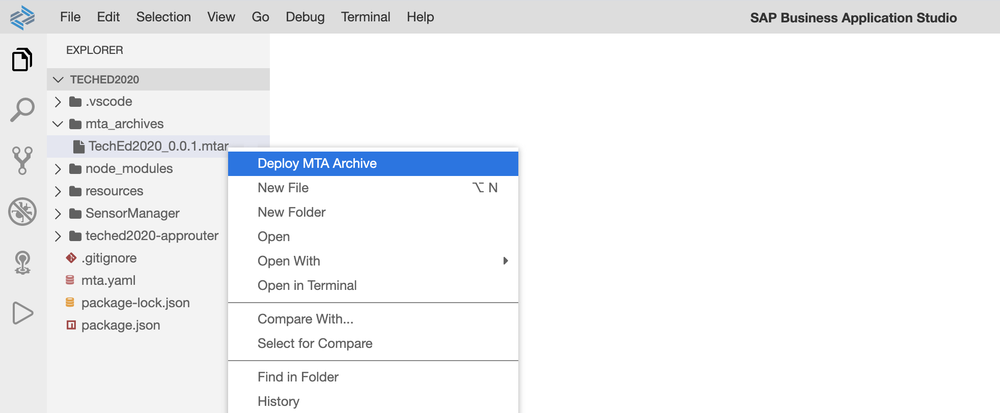

[](https://github.com/SAP-samples/teched2020-DEV164/tree/code/ex11/TechEd2020)

# Exercise 11 - Deployment to SAP Cloud Platform Cloud Foundry

In this exercise you'll learn how easy it is to deploy your application to a cloud foundry environment hosted at the SAP Cloud Platform directly from the SAP Business Application Studio.

## Exercise 11.1 - Create Space in Cloud Foundry

First of all, you have to create a space in your cloud foundry environment whch will host your newly created UI5 application.

1. Open the SAP Cloud Platform Trial by opening *https://cockpit.hanatrial.ondemand.com/cockpit/#/home/trial* in a new browser tab and click on *Enter Your Trial Account* button.
<br>

2. Now, you're redirected to your personal SAP Cloud Platform Cockpit where your subaccounts are listed. Click on the prefered subaccount, e.g. *trial*.
<br>

3. Click on the menu item *Spaces*. Until now, no space was created by you. Click on *Create *
<br>

4. A new popup is opened where you have to specifify the space name e.g. *ui5-apps*. After entering the name, click on the *Create* button.
<br>

5. The newly created space is displayed.
<br>


## Exercise 11.2 - Login to Cloud Foundry

Now, its time to login to your Cloud Foundry environment directly from the SAP Business Application Studio.

1. Open your SAP Business Application Studio and click in the header toolbar on *View* and then select *Find Command...*. A new popup is opend, enter here *CF: Login to cloud foundry*.
<br>

2. A new popup is opened where you're asked for specifing your Cloud Foundry endpoint you want to use. If your environment runs in the EU10-region, this is `https://api.cf.eu10.hana.ondemand.com`.
<br>

3. Enter your email address, which you have used for registering your SAP Cloud Platform account.
<br>

4. Enter your password.
<br>

5. After a few seconds a small window appears in the lower right corner notifying you that the login was successful.
<br>


## Exercise 11.3 - Set Organization and Space

After logging in, you're asked to specify your desired Cloud Foundry organization and space.

1. Open your SAP Business Application Studio and click in the header toolbar on *View* and then select *Find Command...*. A new popup is opend, enter here *CF: Set Org and Space*.
<br>

2. A new popup is opened where you're asked for entering your cloud foundry organization name e.g. *ui5-cloud-foundry*.
<br>

3. Select your newly created space, e.g. *ui5-apps*.
<br>

4. After a few seconds a small window appears in the lower right corner notifying you that the organization and space was set successfully.
<br>


## Exercise 11.4 - Configure Approuter for Redirect

Your application will be available at https://<approuter-url>/<app/id> and the application router will not redirect traffic that hits the root URL. In this step, you will change this.

1. Open file `SensorManager/webapp/manifest.json`.

2. Copy the value of property `sap.app/id`. The value of this property should be *keepcool.SensorManager* in your case.
<br>

3. Open the file `teched2020-approuter/xs-app.json`, add property `welcomeFile` to define the redirect, paste the copied value of the previous step and remove the dot in the value.

````json
{
  "authenticationMethod": "none",
  "welcomeFile": "keepcoolSensorManager",
  "routes": []
}
````

## Exercise 11.5 - Configure UI5 Application

By using the SAP Business Application Studio application templates all files which are located under `SensorManager/test/` and `SensorManager/localService/` are excluded from the build because in a productive application these files are not needed. In our case where the sensor data is placed in a JSON file, the `sensors.json` file has to be included in the build result. 

1. Open `SensorManager/ui5.yaml`. 

2. Remove the `"/localService/**"` entry for the `builder` section.

***SensorManager/ui5.yaml***

````yaml
builder:
  resources:
    excludes:
      - "/test/**"
````

## Exercise 11.6 - Build your Application

Now, its time to build your application. Yeah!

1. Perform a right click on the `mta.yaml` in the root folder.

2. Click on *Build MTA*. The build starts.
<br>

3. When the build finished you'll be notified with a popup in the lower right corner.
<br>


## Exercise 11.7 - Deploy your Application

The build step has created a file named `TechEd2020_0.0.1.mtar` located under `mta_archives`. This file contains your build results.

1. Perform a right click on `mta_archives/TechEd2020_0.0.1.mtar` and click on *Deploy MTA Archive* button. The deployment starts.
<br>

2. After a few minutes the deployment will finish by showing a popup in the lower right corner.
<br>

3. In the deployment logs you'll find the url of the deployed application. Copy the url from the logs, open a new browser tab and paste the url into the browser tab.
<br>

4. Congratulations! You've deployed your UI5 application to SAP Cloud Platform Cloud Foundry.
<br>

## Summary

Horray! You've completed successfully [Exercise 11 - Deployment to SAP Cloud Platform Cloud Foundry](#exercise-11---deployment-to-sap-cloud-platform-cloud-foundry).

Celebrate yourself! You have reached your first level in being an UI5 experts.
