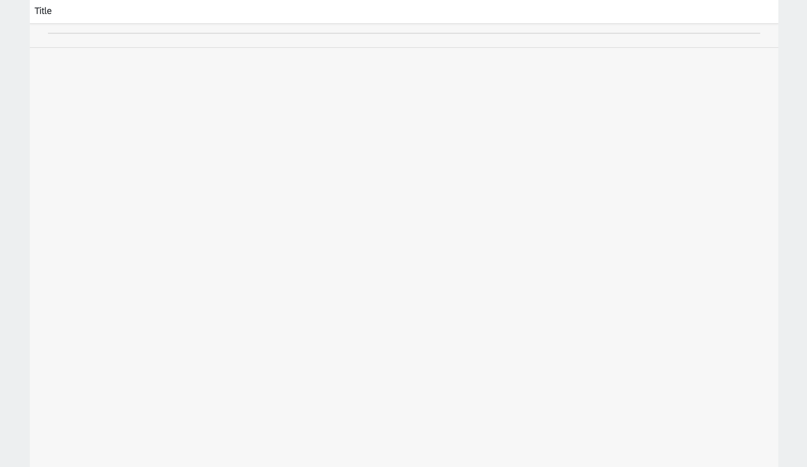
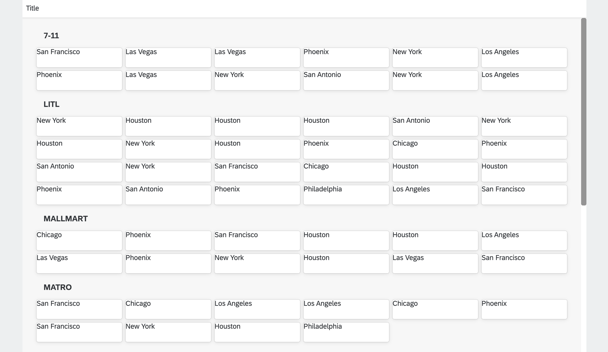

[](https://github.com/SAP-samples/teched2020-DEV164/tree/code/ex3/TechEd2020)
[](https://sap-samples.github.io/teched2020-dev164/exercises/ex3/TechEd2020/SensorManager/webapp/)

# Exercise 3 - Show Sensor Content

In this exercise, you will add a local data service to the application and display the data on the enhanced UI5 view.

## Exercise 3.1 - Import Sensor Data

To simulate a sensor data providing source, you have to add sensor data to the application.

1. Go to folder `SensorManager/webapp/localService`.

2. Perform a right click on the `localService`-folder.

3. In the opened popup, click on `New File`.
<br>

4. Enter `sensors.json` as file name.
<br>

5. Copy and paste the content of the [sensors.json](data/sensors.json) into the newly created file.

## Exercise 3.2 - Configure Data Service

After adding the sensor data to your application, you have to configure the data service which provides the sensor data.

1. Open the `manifest.json` located under `SensorManager/webapp`.

2. Go to section `sap.app`. Here you have to add a new data source with name `sensorSource` which points to the sensor data.

***SensorManager/webapp/manifest.json***

````json
"sap.app": {
    "dataSources": {
        "sensorSource": {
            "type": "JSON",
            "uri": "./localService/sensors.json"
        }
    }
}
````

3. Go to section `sap.ui5`. Here you have to add a new JSONModel with name `sensorModel` which points to the newly created data source.

***SensorManager/webapp/manifest.json***

````json
"sap.ui5": {
    "models": {
        "sensorModel": {
            "type": "sap.ui.model.json.JSONModel",
            "dataSource": "sensorSource"
        }
    }
}
````

## Exercise 3.3 - Add a GridList

After the configuring the data service its time to enrich your `Sensors.view.xml` with some fancy UI5 controls.

1. Open the `Sensors.view.xml` located under `SensorManager/webapp/view`.

2. Add `sap.f` and `sap.ui.layout.cssgrid` to the xml namespace declarations to make sure that the required resources are available in the view.

***SensorManager/webapp/view/Sensors.view.xml***

````xml
...
<mvc:View
    xmlns:mvc="sap.ui.core.mvc"
    xmlns:grid="sap.ui.layout.cssgrid"
    xmlns:f="sap.f"
    xmlns="sap.m"
    displayBlock="true">
...
````

3. Add `sap.f.GridList` to the `content` aggregation of the IconTabBar.

***SensorManager/webapp/view/Sensors.view.xml***

````xml
...
<f:GridList id="sensorsList" noDataText="No sensors">
    <f:customLayout>
        <grid:GridBoxLayout/>
    </f:customLayout>
    <f:items>
        <CustomListItem>
        </CustomListItem>
    </f:items>
</f:GridList>
...
````

4. Switch the browser tab and perform a refresh to see how the UI5 application changed its user interface.
<br>

## Exercise 3.4 - Add Data Binding

After adding the `sap.f.GridList` control, you have to connect the control to the sensor data. Therefore, UI5 provides an mechanism called *Data Binding*.

1. Open the `Sensors.view.xml` located under `SensorManager/webapp/view`.

2. Bind the `items` aggregation of the `sap.f.GridList` to path `sensorModel>/sensors`. `sensorModel`references your recently defined model and `/sensors` points to the property inside. As this is an array with several entries you additionally would like to define a sorting and grouping with the according direction. In the `sorter` you can configure this by using the according properties.

***SensorManager/webapp/view/Sensors.view.xml***

````xml
...
<f:GridList id="sensorsList"
    items="{path: 'sensorModel>/sensors', sorter: {path:'customer', group:true, descending: false}}"
    noDataText="No sensors">
...
````

3. The list items will be defined once as a template. This template will then be repeated to represent each entry of the sensors array. Furthermore we add the location details to our `sap.m.CustomListItem`. `location` hereby references the property of each of the displayed sensor items.

***SensorManager/webapp/view/Sensors.view.xml***
````xml
...
<CustomListItem>
    <Title text="{sensorModel>location}"/>
</CustomListItem>
...
````

4. Lets see if the UI5 application displays the correct sensor data. Therefore switch to the browser tab with opened application preview. Perform a page reload.
<br> 

## Summary

Congratulations! You've completed successully [Exercise 3 - Show Sensor Content](#exercise-3---show-sensor-content).

Continue to [Exercise 4 - Introduce Localization](../ex4/README.md).

## Further Information

* Data Binding: https://ui5.sap.com/#/topic/68b9644a253741e8a4b9e4279a35c247
